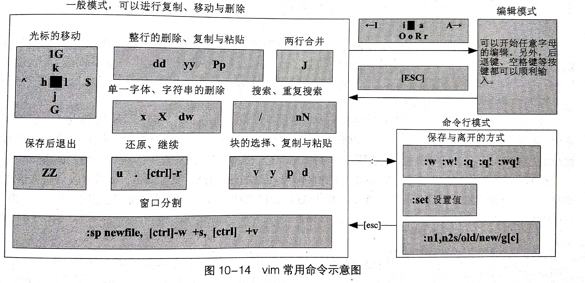

vi分为三种模式：一般模式、编辑模式和命令行模式

- 一般模式：默认模式，可以进行删除、复制、粘贴
- 编辑模式：在一般模式下按下“i、l、o、O、a、A、r、R”等任意一个进入编辑模式。在编辑模式下才能编辑文件内容。按下[Esc]键返回一般模式
- 命令行模式：在一般模式下输入":、/、?"三个中任一个进入命令行模式，此时光标移动到最下面一行。命令行模式下可以进行查找、保存、退出等操作。


vi下的按键说明：

移动光标：	

```
h:左移一位
j:下移一位
k:上移
l:右移
0:光标移动到所在行行首
G:光标移动到文本最后一个字符位置

```


查找替换：

```
/word: 向下查找word
?word: 向上查找word
n: 重复前一个查找的操作
N: 反向进行前一个查找的操作
```

```
:n1,n2s/word1/word2/g: 在n1和n2行之间将word1替换成word2
:1,$s/word1/word2/g: 全文查找word1替换成word2
:1,$s/word1/word2/gc: 全文查找word1替换成word2，并在替换前询问用户
```

删除

```java
x: 向后删除一个字符（相当于Del）
X: 向前删除一个字符（相当于Backspace）
nx: 向后删除n个字符
dd：删除光标所在行一整行
ndd: 相处光标所在行向下n行
d1G: 删除光标所在到第一行所有数据
dG: 删除光标所在到最后一行的所有数据
d$: 删除从光标所在处到该行的最后一个字符
d0: 删除从光标所在处到该行的第一个字符
```

复制

```
yy
nyy
yG	
y1G	
y0
y$
```

粘贴

```
p: 将已复制的数据在光标下一行粘贴
P：粘贴到光标上一行
```

其他

```
J: 将光标所在行与下一行的数据结合成一行
c: 重复删除多个数据
u: 复原前一个操作（相当于undo）
[Ctrl]+r: 重做上一个操作（redo）
```


<br>

一般模式切换到编辑模式

```
i: 从目前光标处插入
I: 从目前所在行的第一个非空格处插入
a: 从目前光标所在的下一个字符处插入
A: 从光标所在行的最后一个字符处插入
o: 从目前光标所在的下一行处插入新一行
O: 从目前光标所在的上一行处插入新一行

上面都是进入Insert插入模式，下面是进入replace替换模式

r: 替换光标所在的那一个字符一次
R: 一直替换光标所在的位置，直到按下Esc为止
```

<br>

命令行模式下的命令

```
:w	写入
:w!	强制写入
:q	离开
:q!	强制离开（不保存）
:wq	写入后离开
:wq!
ZZ	若文件没有更改，直接离开；否则保存后离开
:w[filename]	写入到另一个文件
:r[filename]	在编辑的数据中，读入另一个文件的内容
:n1,n2 w [filename]	把n1到n2行的内容保存成filename文件中的内容

:set nu	显示行号
:set nonu
```

<br>

**vim的恢复功能**：

当使用vim编辑文件时，vim会在被编辑的文件的目录下新建一个名为.filename.swp的暂存文件，对filename文件的所做的操作都会被记录到.filename.swp这个文件当中。

当vim的工作被不正常中断时，导致暂存盘无法通过正常流程来结束，所以暂存文件就不会消失，而继续保存下来。

此时打开文件时，vim会判断文件出现问题并提供可能原因和解决方案

通过R命令，可以加载暂存文件的内容，不过当救回并保存离开vim后，还要手动删除暂存文件。

通过D命令，可以删除暂存文件。

<br>

### Vim的功能

块选择(Visual Block)

```
v	字符选择，会将光标经过的地方反白选择
V	行选择，把光标经过的行反白选择
[Ctrl]+v	块选择，用长方形选择数据
y	复制
d	删除
p	粘贴
```

<br>

多文件编辑

vim可以在一个命令行窗口同时打开多个文件

```
vim file1 file2

:n	编辑下一个文件
:N	编辑上一个文件
:files	列出当前这个vim打开的所有文件
```

利用多文件编辑，可以把一个文件的内容复制到另一个文件中。

<br>

多窗口功能

```
:sp {filename}	可以打开多窗口

[C]+w+j(或向下方向键)	光标移动到下一个窗口
[C]+w+k(或向上方向键)	光标移动到上一个窗口
[C]+w+q	相当于:q
```

<br>

常用命令示意图



<br>


Dos和Linux下文件格式的转换

DOS下的文件断行符是CRLF(^M$) ，而Linux下只是LF。

```
dos2UNIX [-kn] file [newfile]
UNIX2dos [-kn] file [newfile]

-k: 保留该文件原来的mtime时间格式
-n: 保留原本的旧文件，将转换后内容写入到新文件。
```


<br>

语系编码转换

```
iconv --list
iconv -f 原来编码 -t 新编码 file [-o newfile]
```

