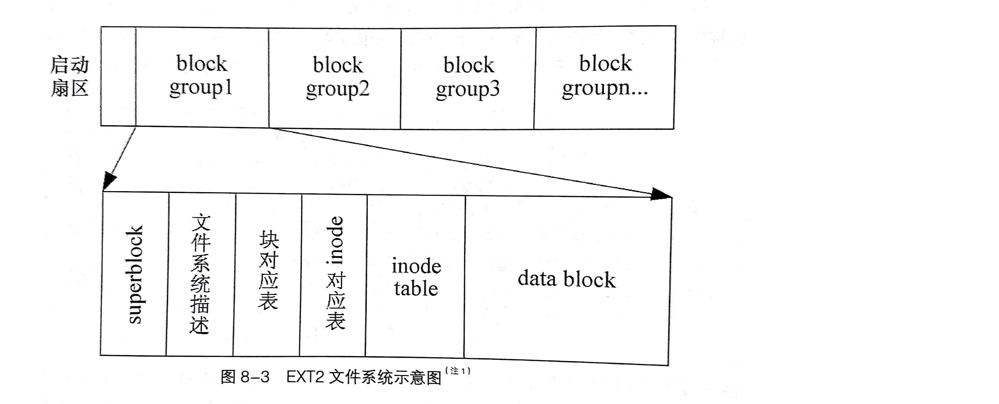
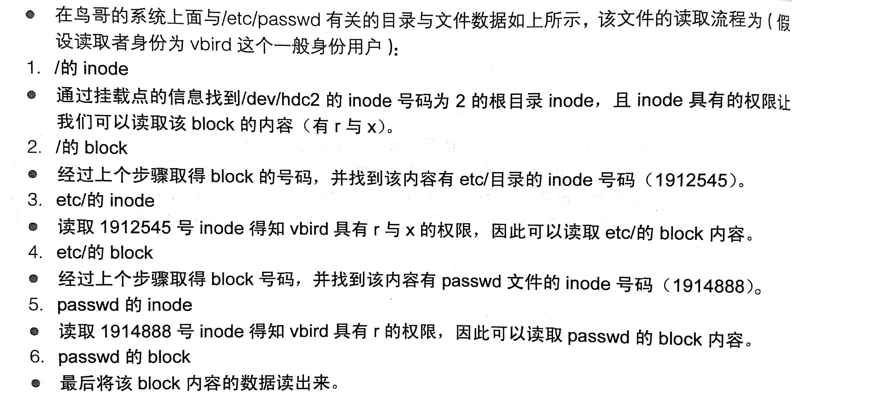

## EXT2文件系统

### 磁盘&分区

扇区Sector是最小的**物理存储**单位，每个扇区512字节。

将扇区组成一个圆，就是柱面Cylinder，柱面是分区partition的最小单位。

第一个扇区最重要，里面有硬盘主引导记录MBR和分区表。MBR占据446字节，分区表占据64字节

对分区的一些限制：

- 主分区和逻辑分区最多有四个
- 扩展分区最多有一个
- 逻辑分区是由扩展分区切割出来的分区
- 能够被格式化后作为数据访问的分区是主分区和逻辑分区，扩展分区无法格式化
- Linux中，IDE硬盘最多59个逻辑分区，SATA则最多11个逻辑分区


### 文件系统特性

EXT2文件系统是索引式文件系统，

文件系统将文件的不同数据存放在不同的块中，权限和属性放在inode中，实际数据放在data block中。另外，还有一个super block会记录整个文件系统的整体信息。

- super block: 文件系统的整体信息，包括inode/block的总量、使用量、剩余量，以及文件系统的格式等
- inode: 记录文件的权限、属性。一个文件占用一个inode，同时记录该文件的数据所在block的号码
- block: 文件实际内容。文件太大可以占用多个block

<br>

Ext2文件系统在格式化的时候基本上是区分为多个块组的，每个块组都有独立的inode/block/superblock系统。

Ext2中，所支持的data block大小由1kb，2kb，4kb三种。在格式化的时候block的大小就规定了。

每个block最多只能放置一个文件的数据。

<br>

inode记录的文件数据：

- 文件访问模式 (r/w/x)
- 文件所有者和组
- 文件大小
- 创建或状态改变时间ctime
- 读取时间atime
- 修改时间mtime
- 定义文件特性的标志flag
- 该文件真正内容的指向pointer

inode的一些特点：

- 固定大小128字节
- 每个文件仅会占用一个inode
- 文件系统能创建的文件数量和inode的数量有关

<br>

块对应表(block bitmap)：根据块对应表，可以快速找到可供使用的block

inode对应表：功能和块对应表类似


<br>

读取文件的流程

新增文件的流程：

- 先确定用户对于欲添加文件袋目录是否具有w与x的权限，若有的话才能添加
- 根据inode bitmap找到没有使用过的inode号码，将文件的权限、属性写入
- 根据block bitmap找到没有使用过的block号码，将实际数据写入block中，并更新inode的block pointer
- 将刚才写入的inode和block数据同步更新inode bitmap和block bitmap，并更新super block内容

<br>


异步处理：内存中的文件由两种状态：clean和dirty。

当系统加载一个文件到内存时，如果没有被更改，默认为clean；如果文件被更改了，此时内存中的数据会被设为dirty。系统会不定时将设置为dirty的数据写回磁盘，以保证磁盘和内存的数据一致性。


## 文件系统的简单操作

查看磁盘和目录的容量：df和du命令

df：列出文件系统的整体磁盘使用

```
-a: 列出所有文件系统
-h: 以易读的G/M/K的格式显示
-T: 连同该分区的文件系统名称（即类型）一起列出
-i: 以inode的数量列出
-k: ...
-m: ...
```

<br>


du：评估文件系统的磁盘使用量

```
-a: 列出所有的文件和目录容量
-s: 仅列出总量
-S: 不包括子目录下的总计
-H: K/M/G以1000为换算单位
-hkm
```


### 连接文件

硬链接hard link：就是在某个目录下新建一条文件名连接到某inode号码的关联记录。

本质上没有产生新的文件，而只是多个文件名对应到同一个inode号码上。

使用硬链接时，磁盘空间和inode的数目都不会改变。

硬链接的限制：

- 不能跨文件系统
- 不能连接到目录

<br>


符号连接symbolic link（就是快捷方式）：创建一个独立的文件，这个文件会让数据的读取方向指向它连接的那个文件的文件名。

本质上就是利用文件作为指向的操作。当源文件被删除时，符号连接的文件就会打开不了。

符号连接和源文件有着不同的inode


<br>

制作连接文件：ln命令

```
ln [-sf] 源文件 目标文件
不加任何参数的话，默认是hard link
-s: symbolic link
-f: 如果目标文件存在，主动将目标文件先删除再创建
```


### 磁盘的分区、格式化、检验和挂载

磁盘分区相关操作：fdisk

```
fdisk [-l] 设备名
-l: 输出设备里的所有分区内容
```

<br>


格式化相关操作：mkfs

```
mkfs [-t 文件系统格式] 设备文件名
系统格式包括：ext3/ext2/vfat等
```

<br>


磁盘检验：fsck、badblocks

<br>


磁盘挂载和卸载：mount

- 单一文件系统不应该被重复挂载在不同的挂载点上
- 单一目录不应该重复挂载多个文件系统
- 作为挂载点的目录理论上应该是空目录。

```
mount -a：依照/etc/fstab文件的数据将所有未挂载的磁盘都挂载上来
mount [-l]：显示目前挂载的信息
mount [-t 文件系统] [-L label名] [-o 额外选项]
```