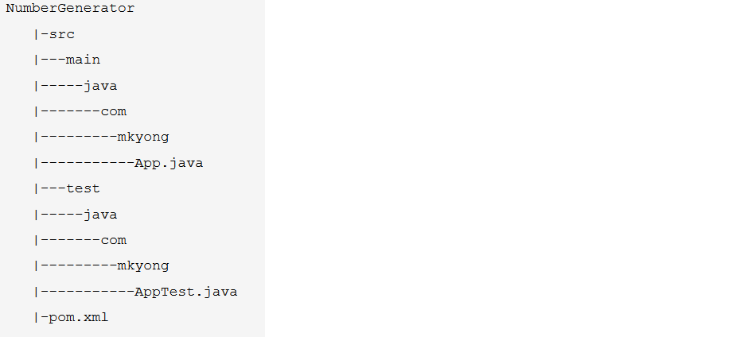

\# 2018/10/31 搭建一个简单maven项目

1. cmd进入命令行

2. 输入以下信息创建一个模板项目：

   ```bash
   mvn archetype:generate -DgroupId={project-packaging}    
   	-DartifactId={project-name}    
   	-DarchetypeArtifactId=maven-archetype-quickstart 
   	-DinteractiveMode=false
   # DgroupId是包名
   # DartifactId是项目名
   ```

3. 项目结构

   

4. 把项目转化成IDEA项目

   ```bash
   cd ProjectName
   mvn idea:idea -DjdkName=1.7
   ```

5. 在pom.xml里把JUnit版本改成4.11

6. 关于pom.xml配置文件

   一切关于jar的配置都在这里。只要在这里添加相应的配置就行。

   ​