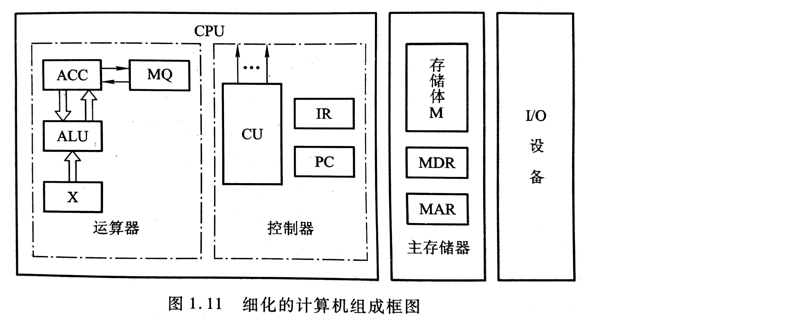

# 第一章 计算机系统概论

## 计算机系统


系统软件：主要用来管理整个计算机系统，监视服务，使系统资源得到合理调度，高效运行。

应用软件：是用户根据任务需要所编制的各种程序。


将高级语言程序翻译成机器语言程序的软件称为**翻译程序**。翻译程序有两种：一种是**编译**程序，一种是**解释**程序。

编译：将源程序全部语句一次全翻译成机器语言程序。只要源程序不变，就无须再次翻译。

解释：一条一条翻译源程序，并在翻译完一条语句后立即执行。特点：翻译一次执行一次，即使下一次重复执行该语句时，也必须重新翻译。


计算机组成和计算机体系结构：

体系结构：能够被程序员所看到的计算机系统的属性。

组成：计算机体系结构中属性的实现。

相同的体系结构下，组成可能是不同的。

<br>

## 计算机基本组成

冯诺依曼计算机的特点:

- 五个部分：**运算器、存储器、控制器、输入设备、输出设备**
- 指令和地址以同等地位存放于存储器内，并可按地址寻访。
- 指令和数据均用二进制数表示。
- 指令有**操作码和地址码**组成。
- 指令在存储器内按顺序存放。通常指令也按顺序执行。
- 机器以运算器为中心。


典型冯诺依曼计算机以运算器为中心。

现代计算机以存储器为中心。

各部件功能：

- 运算器：完成算术运算和逻辑运算，并将运算的中间结果暂存在运算器内
- 存储器：存放数据和程序
- 控制器：控制、指挥程序和数据的输入、运行和处理运算结果

通常将运算器和控制器合称为中央处理器（CPU），把输入/输出设备简称为I/O设备

现代计算机可认为由三部分组成：CPU，I/O，主存储器


（现代计算机组成框图）



### 主存

一个存储单元可以存储一串二进制代码，这串二进制代码称为一个**存储字**，这串二进制代码的位数被称为存储字长。

主存的工作方式就是按存储单元的地址号来实现对存储字各位的存、取。这种存取方式被称为**按地址存取**方式。

MAR：存储器地址寄存器。用来存放欲访问的存储单元的地址，其位数对应存储单元的个数。

MDR：存储器数据寄存器。用于存放代码，其位数与存储字长相等。


### 运算器

运算器最少包括三个寄存器和一个算术逻辑单元。

ACC：累加器，Accumulator

MQ：乘商寄存器，Multiplier-Quotient Register

X：操作数寄存器


### 控制器

三个阶段：

1. 取指，从存储器读出一条指令
2. 分析，分析该执行要完成什么操作，并按寻址特征指明操作数的地址。
3. 执行，根据操作数所在地址以及指令的操作码完成操作

控制器由程序计数器（PC）、指令寄存器（IR）和控制单元（CU）组成。

PC用来存放当前欲执行指令的地址。PC可以自动加一来形成下一条指令的地址。

IR用来存放当前指令，IR的内容来自MDR

​	IR中的操作码送至CU，记作OP(IR) -> CU，用来分析指令。

​	地址码作为操作数地址送至MAR，记作Ad(IR) -> MDR。

CU用来分析当前指令所需要完成的操作。


计算机工作过程;

```
PC->MAR		将PC存储的内容送至MAR，并命令存储器做读操作。
主存0号单元的内容被送入MDR
MDR->IR		取指阶段完成
OP(IR)->CU	CU分析指令的内容，发现是取数指令
Ad(IR)->MAR	CU将IR中的地址码送至MAR，并命令存储做读操作，将该地址单元的操作数x送至MDR
MDR->ACC	将MDR里的操作数送至寄存器ACC，此时PC+1
```


机器字长：CPU一次能处理数据的位数。通常和CPU寄存器位数有关。

字长越长，数表示范围越大，精度越高。


存储器容量=主存容量+辅存容量

存储容量=存储器单元个数(MAR) \* 存储字长(MDR)


MIPS：Million Instruction Per Second，百万条指令每秒，计量计算机运算速度的单位。

CPI：Cycle Per Instruction，执行一条指令所需的时钟周期

FLOPS：浮点运算次数每秒

