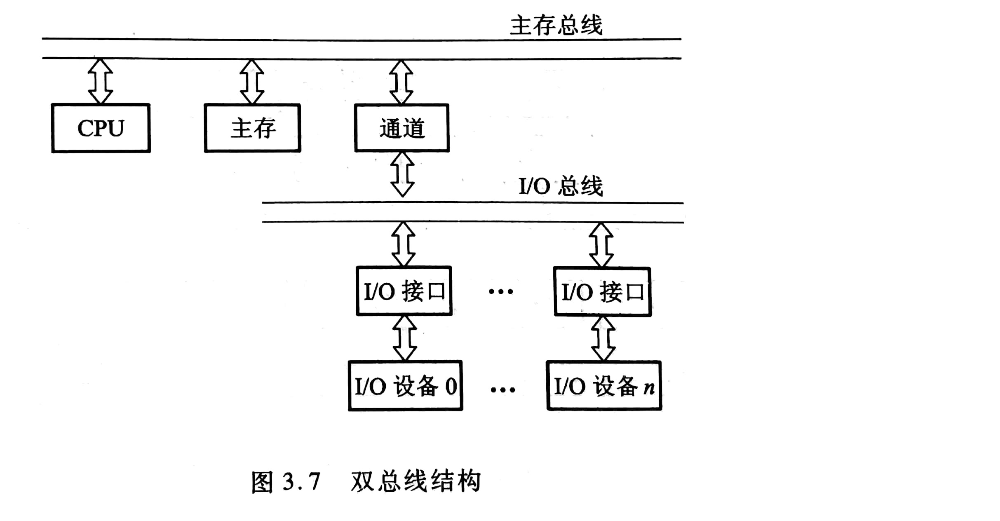

# 第三章 系统总线

两种互连方式：

- 分散连接
- 总线连接：将各部件连到一组公共信息传输线上。

总线是连接多个部件的信息传输线，是各部件共享的传输介质。在某一时刻，只允许有一个部件向总线发送信息，而多个部件可以同时从总线上接收相同的信息。

## 总线分类

- 片内总线：芯片内部的总线。

- 系统总线：CPU、主存、IO设备各部件之间的信息传输线。又称板及总线（板间总线）

  按传输信息的不同，系统总线可分为以下三类：

  - 数据总线：双向传输总线，数据总线位数称为**数据总线宽度**，是衡量系统性能的一个参数。
  - 地址总线：用来指出数据总线上源数据/目的数据在主存单元或IO设备上的地址
  - 控制总线：发出控制信号

- 通信总线

总线特性：

- 机械特性
- 电气特性
- 功能特性
- 时间特性

## 总线结构

总线通常可以分为单总线结构和多总线结构

- 单总线结构：把各设备都挂在一组总线上。允许各设备之间直接交换信息。

- 多总线结构

  双总线结构：将速度较低的IO设备从单总线上分离出来

  

  多总线结构：对速率不同的IO设备进行分类，然后将它们连接在不同的通道上。

## 总线控制

包括判优控制（仲裁逻辑）和通信控制。

### 判优控制

总线上各类设备，可以分为主设备和从设备。

主设备对总线有控制权，总线上信息的传送由主设备启动。

从设备对总线没有控制权，只能响应从主设备发来的命令。

若多个主设备同时要使用总线时，就由总线控制权的判优逻辑按一定优先等级顺序确定哪个主设备能使用总线。

总线判优控制可以分为集中式和分布式。

集中控制优先权仲裁方式：

- 链式查询。离总线控制部件遜的设备有最高的优先级。
- 计数器定时查询
- 独立请求方式。每一条设备都有一对总线请求线和总线同意线。可根据优先次序确定响应哪一台设备的请求。

### 通信控制

将完成一次总线操作的时间称为总线周期，可分为四个阶段：

- 申请分配
- 寻址
- 传数
- 结束

通信控制：主要解决通信双方如何获知传输开始和传输结束的问题

- 同步通信：通信双方由统一时标控制数据传送。

  同步通信优点：规定明确、统一，模块间配合简单一致。

  缺点：强制性同步，对所有从模块都同一限时，所以必须要以最慢的部件来设计公共时钟。影响效率，缺乏灵活性。

  一般用于总线长度较短、各部件存取时间比较一致的场合。

- 异步通信：应答/握手

  主模块发出请求信号，等到从模块返回的响应信号时才开始通信。

  - 不互锁
  - 半互锁：主模块发出请求信号后，必须等到回答信号才能撤销其请求信号
  - 全互锁：从模块发出回答信号后，也必须等到主模块已撤销请求信号后才能撤销其他回答信号。

  波特率：单位时间内传送二进制数据的位数，单位bps

  比特率：单位时间内传送二进制有效数据的位数。（排除了附加位，如起始位、终止位、校验位等）单位bps

- 半同步通信

- 分离式通信

  将一个传输周期分解为两个子周期。第一个子周期中，模块A将各种有关信息发到系统总线上，经过传输，由有关的从模块B接收下来。此时A立即放弃总线使用权。在第二个子周期中，B经过一系列操作后，将A所需的数据准备好，再由B申请总线使用权。

  两个传输子周期都只有单方向的信息流。