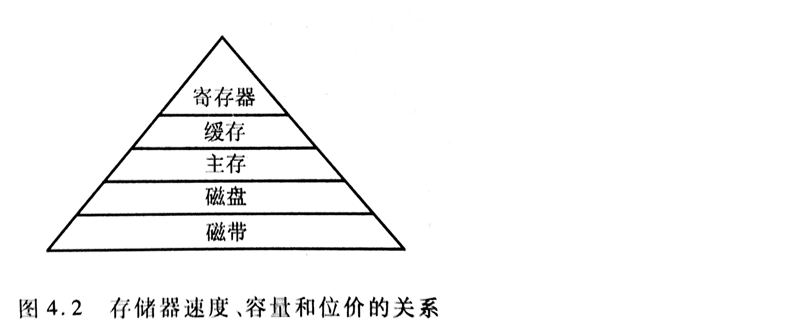
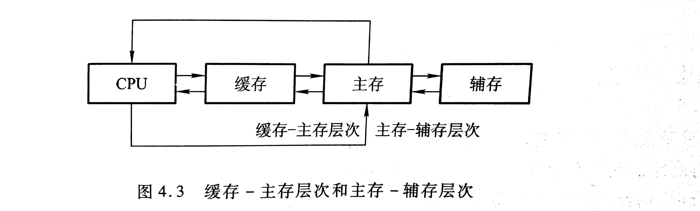
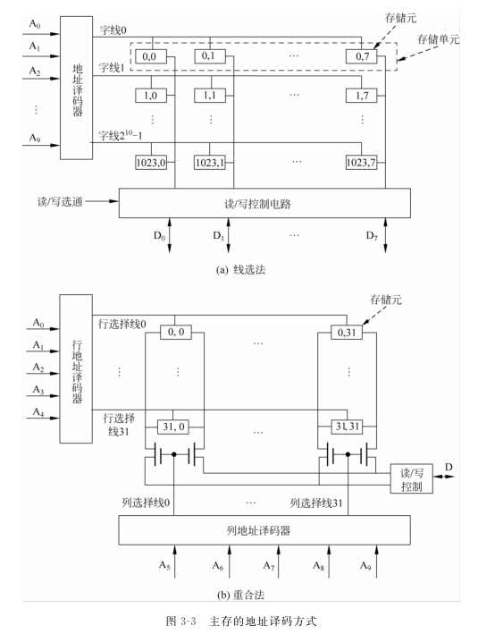

# 第四章 存储器

## 概述

### 存储器分类

按存储介质：

- 半导体。特点：易失性存储器
- 磁表面。非易失性
- 磁芯。不易失性永久记忆存储器
- 光盘

按存取方式：

- 随机存储器（RAM），RAM又分为静态RAM和动态RAM
- 只读存储器（ROM）
- 串行访问存储器：按物理地址的先后顺序寻址

按作用：

- 主存储器
- 辅存
- 缓存（Cache）

### 层次结构

存储器的三个性能指标：速度、容量、每位价格

CPU和缓存、主存可以直接交换信息，缓存能和CPU、主存交换信息。主存可以和CPU、缓存、辅存交换信息。

缓存-主存层次主要解决CPU和主存速度不匹配的为题

主存-辅存层次主要解决存储系统容量问题。

虚拟存储器

逻辑地址 & 物理地址

## 主存

主存中各存储单元的空间位置是由单元地址号来表示的，而地址总线是用来指出存储单元地址号的。

按字节寻址：存储空间的最小编址单位是字节

按字寻址：存储空间的最小编址单位是**存储字**

Q：字长是32位，对于24位地址线的主存而言。按字节寻址的范围是(2^24B / 2^20)M / 1B = 16M

按字寻址的范围是(2^24 / 2^ 20) / (32/8) = 4M

https://blog.csdn.net/lishuhuakai/article/details/8934540

主存的主要技术指标是**存储容量**和存储速度

存储容量=存储单元个数 * 存储字长 = 存储单元个数 * 存储字长 * 8 (字节)

存储速度由存取时间和存取周期来表示。

存取时间分为读出时间和写入时间

存储器**带宽**：单位时间内存储器存取的信息量。单位：字/秒，字节/秒

如何提高存储器带宽：

- 缩短存取周期
- 增加存储字长，使得每个存取周期可以读写更多二进制位数
- 增加存储体。

### 半导体芯片

半导体芯片内有具有记忆功能的存储矩阵、译码驱动电路和读写电路等。

存储芯片通过三类线和外部连接。

地址线单向输入，其位数和芯片容量有关。

数据线双向。其位数和芯片可读出或写入的数据位数有关。

地址线和数据线的位数共同反映了存储芯片的容量。

eg：地址线10根，数据线4根，则芯片容量为2^10 * 4 = 4K位。

控制线分为读/写控制线和片选线两种。读写控制线决定芯片进行读/写操作，片选线用来选择存储芯片。（用片选信号确定哪个芯片被选中）

译码驱动方式：线选法和重合法。

线选法：用一根字选择线（字线）直接选中一个存储单元中的某位。结构简单，只适用于容量不大的存储芯片。

重合法：二维矩阵，使用64根选择线就可以选择32 * 32矩阵中的任意一位。

### 随机存取存储器

静态RAM（SRAM）：易失性半导体存储器（断电时信息丢失）SRAM存取速度快，但集成度低，功耗大，一般用来组成高速缓冲存储器。

动态RAM（DRAM）：易失性，分为三管式和单管式。DRAM容易集成、位价低，容量大、功耗低，但存取速度比SRAM慢。常用来组成大容量主存系统。

DRAM常见刷新方式3种：集中刷新、分散刷新、异步刷新。分散刷新不存在“死时间”

RAM的读周期：

在整个读周期中，WE始终是高电平。

读周期和读时间：读周期是指对芯片进行两次读操作的最小间隔时间。读周期>=读时间

RAM的写周期：

片选信号CS和写命令信号WE都是低电平。

写周期=滞后时间+写入时间+写恢复时间

### 只读存储器

根据制造工艺的不同，ROM可分为：

掩膜ROM（MROM）

一次性编程ROM（PROM）

可擦除可编程ROM（EPROM）

在EPROM的基础上， 还可以局部擦写的ROM是EEPROM

闪存（Flash）

固态硬盘

## 习题

某一SRAM芯片，容量为1024 * 8位，除电源和接地端外，该芯片的引脚最小数为

由1024可知，该芯片地址线要10根；由8可知，数据线要8根。再加上读写控制线和片选线。该芯片引脚最小为10+8+2=20（如果读写线分开的话，最少21）

某一DRAM芯片，采用地址复用技术，其容量是1024 * 8位，除电源和接地端外，该芯片的引脚最小数为（读写控制线为2根）

采用地址复用技术，地址线只需要一半，即5根。数据线要8根。加上行通选、列通选、读、写，一共17根。

