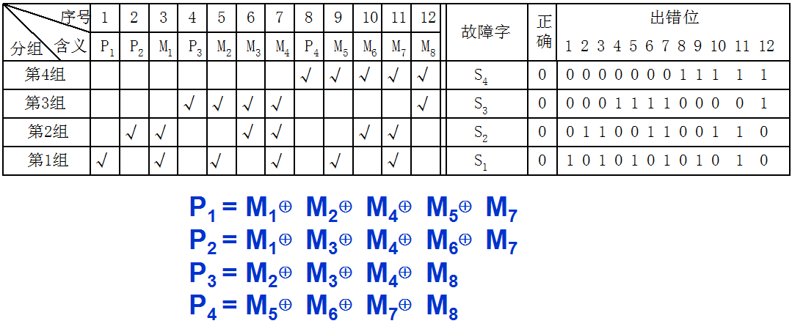

# 第四章 存储器

## 概述

### 存储器分类

按存储介质：

- 半导体。特点：易失性存储器
- 磁表面。非易失性
- 磁芯。不易失性永久记忆存储器
- 光盘

按存取方式：

- 随机存储器（RAM），RAM又分为静态RAM和动态RAM
- 只读存储器（ROM）
- 串行访问存储器：按物理地址的先后顺序寻址

按作用：

- 主存储器
- 辅存
- 缓存（Cache）

### 层次结构

存储器的三个性能指标：速度、容量、每位价格

CPU和缓存、主存可以直接交换信息，缓存能和CPU、主存交换信息。主存可以和CPU、缓存、辅存交换信息。

缓存-主存层次主要解决CPU和主存速度不匹配的为题

主存-辅存层次主要解决存储系统容量问题。

虚拟存储器

逻辑地址 & 物理地址

## 主存

主存中各存储单元的空间位置是由单元地址号来表示的，而地址总线是用来指出存储单元地址号的。

按字节寻址：存储空间的最小编址单位是字节

按字寻址：存储空间的最小编址单位是**存储字**

Q：字长是32位，对于24位地址线的主存而言。按字节寻址的范围是(2^24B / 2^20)M / 1B = 16M

按字寻址的范围是(2^24 / 2^ 20) / (32/8) = 4M

https://blog.csdn.net/lishuhuakai/article/details/8934540

主存的主要技术指标是**存储容量**和存储速度

存储容量=存储单元个数 * 存储字长 = 存储单元个数 * 存储字长 * 8 (字节)

存储速度由存取时间和存取周期来表示。

存取时间分为读出时间和写入时间

存储器**带宽**：单位时间内存储器存取的信息量。单位：字/秒，字节/秒

如何提高存储器带宽：

- 缩短存取周期
- 增加存储字长，使得每个存取周期可以读写更多二进制位数
- 增加存储体。

### 半导体芯片

半导体芯片内有具有记忆功能的存储矩阵、译码驱动电路和读写电路等。

存储芯片通过三类线和外部连接。

地址线单向输入，其位数和芯片容量有关。

数据线双向。其位数和芯片可读出或写入的数据位数有关。

地址线和数据线的位数共同反映了存储芯片的容量。

eg：地址线10根，数据线4根，则芯片容量为2^10 * 4 = 4K位。

控制线分为读/写控制线和片选线两种。读写控制线决定芯片进行读/写操作，片选线用来选择存储芯片。（用片选信号确定哪个芯片被选中）

译码驱动方式：线选法和重合法。

线选法：用一根字选择线（字线）直接选中一个存储单元中的某位。结构简单，只适用于容量不大的存储芯片。

重合法：二维矩阵，使用64根选择线就可以选择32 * 32矩阵中的任意一位。

### 随机存取存储器

静态RAM（SRAM）：易失性半导体存储器（断电时信息丢失）SRAM存取速度快，但集成度低，功耗大，一般用来组成高速缓冲存储器。

动态RAM（DRAM）：易失性，分为三管式和单管式。DRAM容易集成、位价低，容量大、功耗低，但存取速度比SRAM慢。常用来组成大容量主存系统。DRAM采用**地址复用**（地址线数减半）。

DRAM常见刷新方式3种：集中刷新、分散刷新、异步刷新。分散刷新不存在“死时间”

RAM的读周期：

在整个读周期中，WE始终是高电平。

读周期和读时间：读周期是指对芯片进行两次读操作的最小间隔时间。读周期>=读时间

RAM的写周期：

片选信号CS和写命令信号WE都是低电平。

写周期=滞后时间+写入时间+写恢复时间

### 只读存储器

ROM也采用随机存取的方式。

根据制造工艺的不同，ROM可分为：

MROM：掩膜ROM，在芯片生成过程中直接写入，写入后不再能更改。

PROM：一次可编程ROM，允许用户利用专门的设备写入自己的程序，一旦写入，内容无法改变。

EPROM：可擦除可编程ROM。允许用户对内容多次改写。需要修改内容时，先将其全部内容擦除，然后再编程。EPROM编程次数有限，且写入时间过长，因此无法替代RAM

EEPROM：在联机条件下，通过字擦除或页擦除的方式，可以局部擦写内容。

Flash：闪存，快擦型存储器。擦写速度快，可以高速编程，存储器访问周期短，接口简单。既可以在不加电的情况下长期保持信息，又可以在线进行快擦和重写。

固态硬盘

### 存储器和CPU的连接

存储容量的扩展：位扩展和字扩展

位扩展：增加存储字长。2片1K × 4的芯片可以组成为1个1K×8的存储器

字扩展：增加存储字的个数。2片1K×4的芯片可以组成1个2K×4的存储器

字、位扩展：同时增加存储字的个数和存储字长。

存储器和CPU连接：

地址线的连接：将CPU地址线的低位和存储芯片的地址线连接。

数据线的连接：对存储芯片扩位，使其数据位数和CPU的数据线数相等。

读/写线连接：如果CPU读写线只有一条，那直接和存储芯片的读写控制端相连。如果读命令线和写命令线分开，那么把CPU读命令线和存储芯片的允许读控制端相连，把CPU写命令线和存储芯片的允许写控制端相连

P94例4.1

### 存储器的校验

纠错理论：

$L-1=D+C, D>=C$

编码最小距离L越大，其检测错误的位数D越大，纠正错误的位数C越大。

由若干位代码组成的一个字叫“码字”，将两个码字逐位比较，具有不同代码的位的个数叫做这两个码字间的“距离”，也称为“海明距离”。

码距与检错、纠错能力之间存在一定的关系，当码距d≤4时，关系如下：

- 如果码距d为奇数，则能发现d–1位错，或者能纠正(d–1)/2位错。

- 如果码距d为偶数，则能发现d/2位错，并能纠正(d/2–1)位错。

汉明码：对n位二进制代码，k位检测位：

$2^k >= n+k+1$

将数据位和校验位按某种方式排列为一个(n+k)位的码字，该码字中每一位的出错位置与故障字的数值建立关系

如果故障字各位全部是0，则表示没有发生错误。如果故障字中有且仅有一位为1，则表示校验位中有一位出错，不需要纠正。如果故障字中多位为1，则表示有一个数据位出错，其在码字中的出错位置由故障字的数值来确定。纠正时只要将出错位取反即可

**汉明码**分配规则：

将n+k位代码从左向右依次编为1,2,3,..,n+k位，将k位校验位依次插入在第1,2,4,8,..,2^(k-1)位上。

C1检测的g1小组包含1,3,5,7,9,..位

C2检测的g2小组包含2,3,6,7,10,...位

C4检测的g3小组包含4,5,6,7,12,..位

C8检测的g4小组包含8,9,10,11,..位

小组划分规则：

- 每个小组gi有且仅有一位为它所独占，即2^(i-1)位
- 每两个小组gi和gj共同占用一位是其他小组没有的，即2^(i-1)+2^(j-1)位
- 每三个小组gi、gj和gt共同占用一位是其他小组没有的，即...
- 以此类推

实例：

注：8位数据位Mi，4位校验位Pi

## 高速缓冲存储器

CPU访问Cache命中：所需要的字已在缓存中，即可直接访问Cache。

CPU访问Cache不命中：所需要的字不在缓存中，此时需将该字所在的主存整个字块一次性调入Cache中

CPU和Cache是字传送，Cache和主存是字块传送。

### 命中率

CPU要访问的信息已在Cache中的概率

Nc：访问cache总命中次数。Nm：访问主存总次数

cache的读写操作：

- 写直达法：又称存直达法，写操作时同时写入cache和主存
- 写回法：写操作只把数据写入cache，当cache的数据被替换出去时才写回主存。

cache的改进：

- 单一缓存&两级缓存
- 统一缓存&分立缓存。分立缓存：指令和数据分别存在两个缓存中，一个称指令cache，一个称数据cache

### cache和主存的映射

直接映射、全相联映射、组相联映射

直接映射：

全相联映射

全相联映射允许主存每一字块映射到cache中任何一块位置。灵活，命中率高，冲突少。

访问cache中主存字块标记要和cache中的全部标记位进行比较，即“按内容寻址”

组相联映射

直接映射和全相联映射的一种折中。

二路组相联：组内有2块

P120例4.9

替换策略：

FIFO：先进先出

LRU：最近最少使用算法

随机

## 虚存

页式、段式、段页式

快表

（操作系统里有讲，这里就不复习了）

## 辅存

外部储存器，非易失性。容量大，速度慢，价格低，可脱机保存信息。

磁表面储存器：硬磁盘、软磁盘、磁带

其他：光盘

循环冗余校验码CRC：基于模2运算而建立编码规律的校验码

模2运算的规律：

- 模2加和模2减的结果是相等的。两个相同数的模2和恒为0

  $0±1=1, 1±1=0, 0±0=0, 1±0=1$

- 模2乘是按模2和求部分积之和。

  $0×0＝0 ,     0×1＝0  ,       1×0＝0  ,       1×1＝1$

- 模2除是按模2减求部分余数。

  $0÷1＝0       , 1÷1＝1$

  每求一位商使部分余数减少一位。上商的原则：当部分余数的首位为1时，上商1；当部分余数的首位0时，上商0.当部分余数的位数小于除数的位数时，该余数即为最后余数。

光盘：

- CD-ROM：只读型光盘。
- WORM：只写一次型光盘
- 可擦写光盘

## 习题

Q1:	某一SRAM芯片，容量为1024 * 8位，除电源和接地端外，该芯片的引脚最小数为

A:	由1024可知，该芯片地址线要10根；由8可知，数据线要8根。再加上读写控制线和片选线。该芯片引脚最小为10+8+2=20（如果读写线分开的话，最少21）

Q2:	某一DRAM芯片，采用地址复用技术，其容量是1024 * 8位，除电源和接地端外，该芯片的引脚最小数为（读写控制线为2根）

A:	采用地址复用技术，地址线只需要一半，即5根。数据线要8根。加上行通选、列通选、读、写，一共17根。

Q3:	DRAM的刷新是以（行）为单位的，DRAM采用（分散刷新）不存在死时间

Q4:	汉明码

